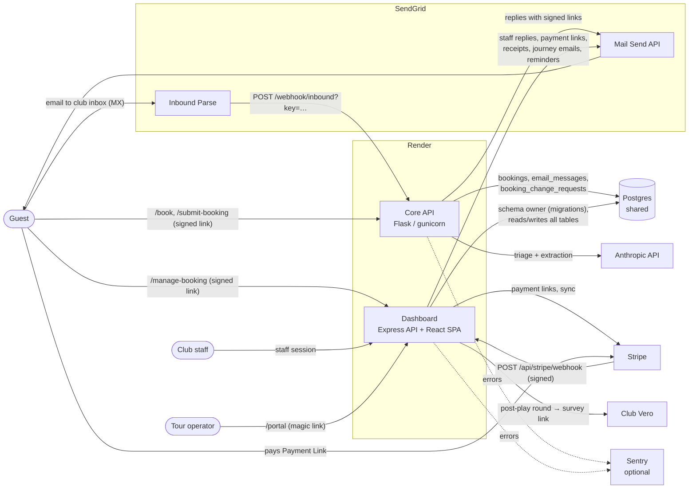
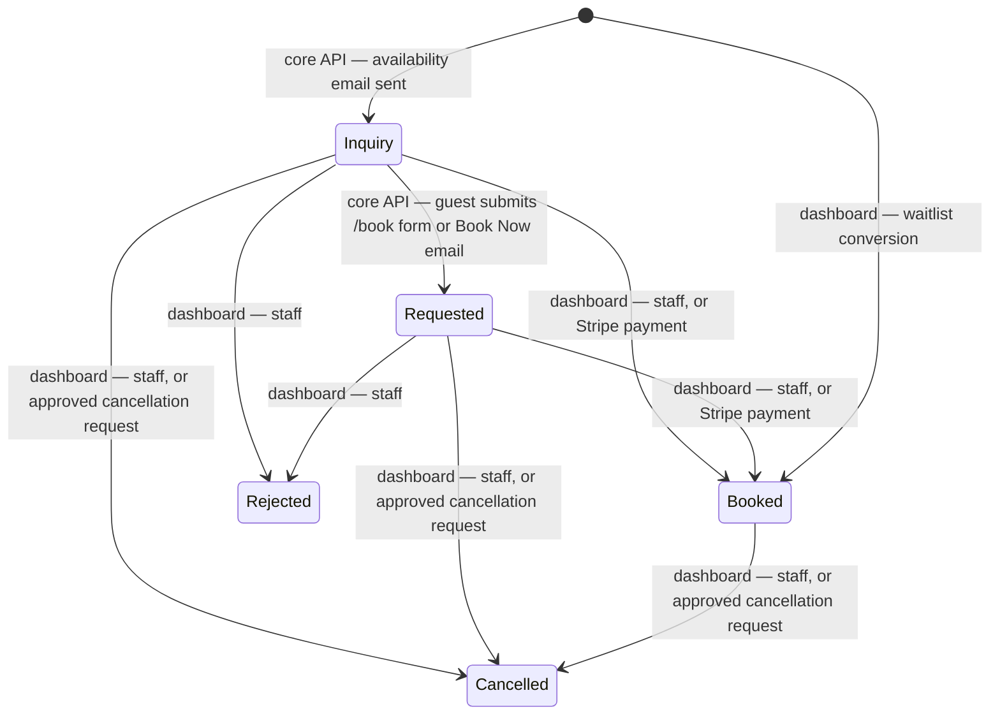
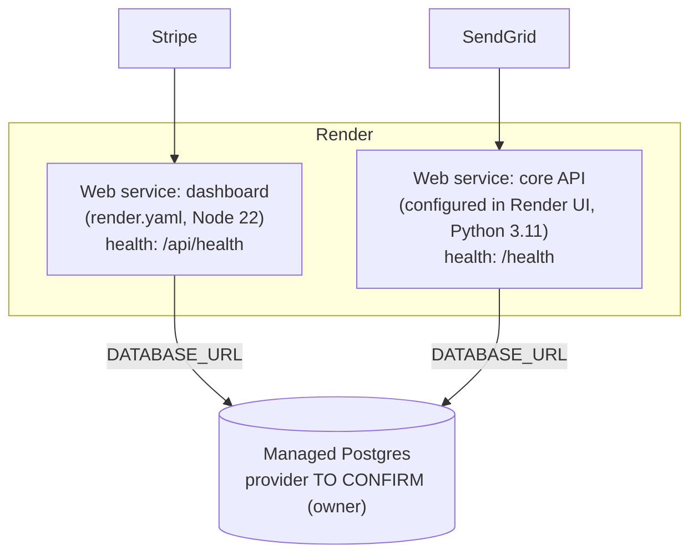

# TeeMail architecture

Product-level view of **TeeMail**, an email booking assistant for golf clubs. It covers both services and the contracts between them. Service-level detail lives in each repository:

- **Core API** (Python/Flask, [`jimbobirecode/Demo_core_api`](https://github.com/jimbobirecode/Demo_core_api)): [README](https://github.com/jimbobirecode/Demo_core_api/blob/main/README.md), [docs/API.md](https://github.com/jimbobirecode/Demo_core_api/blob/main/docs/API.md), [docs/SECURITY.md](https://github.com/jimbobirecode/Demo_core_api/blob/main/docs/SECURITY.md).
- **Dashboard** (Node/Express + React, this repository): [README](../README.md), [API.md](API.md), [SECURITY.md](SECURITY.md), [DATA_MODEL.md](DATA_MODEL.md).

> Links to the core API point at its `main` branch. Until the hardening branch `claude/amazing-newton-jmg7vw` is merged there, the documents referred to exist on that branch only.

## Components



## Responsibilities

| | Core API | Dashboard |
|---|---|---|
| Users | SendGrid (webhook), guests (booking form) | Club staff (admin/staff roles), tour operators (portal), guests (manage-booking page), Stripe (webhook) |
| Inbound email | Receives, authenticates (webhook key, SPF/DKIM), triages with Anthropic, routes (auto-reply / Inbox / Guest Request / ignore) | Shows held emails in the **Inbox**; staff reply, dismiss or link them to a booking |
| Bookings | Creates `Inquiry` bookings with offered tee times; moves them to `Requested` when the guest submits the form or a Book Now email | Lists, filters, edits (status, note, tee time, payment), exports, imports tee sheets, converts waitlist entries; Stripe payment moves `Inquiry`/`Requested` to `Booked` |
| Guest changes | Files change/cancel emails from the booking's guest as `Pending` requests | Manage-booking page files requests; staff approve/decline on **Guest Requests** (approving a cancellation sets `Cancelled`) |
| Outbound email | Availability replies, acknowledgements, holding emails | Staff replies, change-request outcomes, payment links and receipts, pre-arrival/post-play campaigns, operator reminders, password reset / invitation / portal sign-in links |
| Payments | None | Stripe Payment Links, webhook, periodic sync, receipts |
| Schema | Never alters it; checks `bookings` columns at start-up | **Owns it**: `db/migrations/`, applied before the server listens ([MIGRATIONS.md](MIGRATIONS.md)) |
| Accounts | None | `dashboard_users`, `password_resets`, `operator_portal_links` |

## Shared contracts

### Database

One Postgres database. The dashboard's migrations define every table; the core API reads/writes `bookings`, `email_messages` and `booking_change_requests` and reads `tee_times`. Table-by-table ownership: [DATA_MODEL.md](DATA_MODEL.md#ownership).

Both services scope rows by club: the core API uses its `CLUB_ID` (club profile), the dashboard uses the signed-in account's `dashboard_users.customer_id`. **These values must be equal** for a club's bookings to appear on its dashboard (the dashboard logs a warning at boot when users exist for a club that has no bookings, `server/src/index.js` `reportContents`).

### Booking references

| Issued by | Format | Code |
|---|---|---|
| Core API (enquiries) | `PREFIX-YYYYMMDD-XXXXXXXXXX`: profile prefix (`RDG`, `TMG`), date, 10 chars `[A-Z0-9]` from `secrets` (older rows: 4 chars) | `db.generate_booking_reference`, `club_config.booking_ref_pattern` (core API) |
| Dashboard (waitlist conversion; tee-sheet row without its own reference) | The same format: `BOOKING_REF_PREFIX` (default `TMG`; must be one of the core API's profile prefixes), date in the club time zone, 10 chars `[A-Z0-9]` from `crypto.randomInt` | `server/src/lib/booking-ref.js` `mintBookingReference` |
| Dashboard, older rows | `BOOK-YYYYMMDD-XXXX`, `IMP-YYYYMMDD-XXXX-NNNN` (before October 2026) | – |
| Seeds (sample data) | `RD-DEMO-…` | `scripts/seed.mjs`, `db/seeds/*.sql` |

`bookings.booking_id` is `UNIQUE`. The core API recognises a reference in a guest's email by its pattern (any profile prefix), so references the dashboard issues now link replies too; the older `BOOK-`/`IMP-` ones do not match and are only found through their manage link or by staff. Import batches keep their own id (`IMP-YYYYMMDD-XXXXXX`, `bookings.import_batch`), which is not a booking reference.

### Signed booking links (`BOOKING_LINK_SECRET`)

```
token = base64url( HMAC-SHA256( key = BOOKING_LINK_SECRET, msg = "<club>|<booking_id>" ) )[0:32]
```

- Core API: `booking_form.booking_token` signs `/book` links and the manage-booking link it puts in acknowledgement emails (`DASHBOARD_URL` + `/manage-booking?ref=…&token=…`).
- Dashboard: `signBooking` / `verifyBookingToken` in `server/src/lib/change-request-domain.js`; `manageUrlFor` builds `APP_URL/manage-booking?ref=…&token=…` for the emails it sends.
- **The secret must be identical on both services.** The dashboard falls back to `JWT_SECRET` when `BOOKING_LINK_SECRET` is unset (and warns at boot in production); the core API then cannot issue links that verify on the dashboard.
- Tokens carry no expiry (the format is shared and already in guests' inboxes). The dashboard refuses a manage link 30 days after the play date (`MANAGE_LINK_GRACE_DAYS`, HTTP 410); the core API's form only accepts bookings still in `Inquiry`/`Pending`/`Requested`.
- Rotating the secret invalidates every outstanding link in both services ([DEPLOYMENT.md](DEPLOYMENT.md#booking_link_secret)).

### Booking status lifecycle



| Change | Who | Where |
|---|---|---|
| create as `Inquiry` | Core API | `db.py` (core API) |
| `Inquiry`/`Pending`/`Requested` → `Requested` | Core API (form or Book Now email from the booking's guest) | `booking_form.py`, `Conolidated.py` (core API) |
| any → any allowed status | Staff on the dashboard | `PATCH /api/bookings/:id/status` (`server/src/routes/bookings.js`); allowed values `ALLOWED_STATUSES` in `server/src/lib/bookings-domain.js` |
| `Inquiry`/`Requested` → `Booked` | Stripe payment (webhook or sync) | `server/src/lib/record-payment.js`, `applyPaidSession` in `payment-link-domain.js` (a `Rejected`/`Cancelled` booking is never revived) |
| → `Cancelled` | Staff approving a guest/operator cancellation request | `POST /api/changes/:id/approve` (`server/src/routes/changes.js`) |
| create as `Booked` | Staff converting a waitlist entry | `POST /api/waitlist/:id/convert` |
| tee-sheet import | Staff upload; status read from the sheet | `server/src/routes/imports.js` |

`Pending` (Streamlit-era spelling of `Inquiry`) and `Confirmed` (retired stage, now `Booked`) are still accepted on input and normalised; migration `0005` rewrote stored rows. Payment status (`Unpaid`, `Pending`, `Deposit paid`, `Paid`, `Refunded`, `Written off`) is a separate column.

### `email_messages` (conversation log and Inbox)

- **Core API** inserts every inbound email on arrival (`routed_to = 'queued'`, `message_id` = its Message-ID — unique per club among inbound rows, migration `0007` — SPF/DKIM results in `extraction->'inbound'`), claims it (`processing`), then updates it with the Anthropic triage result (`intent`, `summary`, `extraction`, `draft_reply`) and the route; held emails get `routed_to = 'inbox'`, `review_status = 'open'`, `review_reason`. It also inserts each outbound email it sends.
- **Dashboard** reads them for the Inbox (rows still `queued`/`processing` are labelled but never counted or listed as needing a person) and each booking's conversation, updates `review_status` (`replied`/`dismissed`/`open`), `handled_at/by` and `booking_id` (link), inserts every email it sends (`server/src/lib/email-log.js`) and inserts portal enquiries as `inbound` rows with `intent = 'operator_request'`.

### `booking_change_requests`

- **Core API** inserts `Pending` requests read from email (`source = 'email'`, `email_message_id`), only when the sender is the booking's guest.
- **Dashboard** inserts `Pending` requests from the manage-booking page and the operator portal (`source = 'link'`), and resolves them: `Approved`, `Declined`, or `Applied` for an approved cancellation. Nothing in a request changes a booking until staff approve it.

## Deployment topology



- Two Render web services, TLS terminated by Render. Each trusts exactly one proxy hop for the client IP.
- The dashboard serves the API and the built SPA from one origin (`web/dist`), so no CORS in production.
- **Deploy order: dashboard first** (it applies migrations before listening), then the core API. Details: [DEPLOYMENT.md](DEPLOYMENT.md).
- Render plan, region and instance counts: **TO CONFIRM (owner)**. `render.yaml` declares `plan: free`; the in-memory throttles assume one dashboard instance ([SECURITY.md](SECURITY.md#known-issues-and-residual-risks)).
