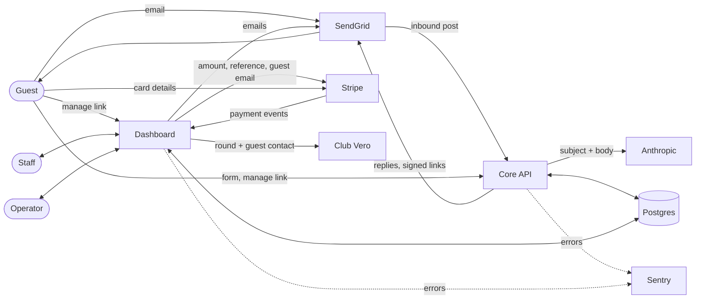

# Data flows (TeeMail product)

What personal data TeeMail processes across both services, where it goes and how long it is kept. Derived from the code of both repositories; organisational facts the code cannot show are marked **TO CONFIRM (owner)**. The core API's own detail (inbound email lifecycle, booking form, Anthropic payloads) is in its [docs/DATA_FLOWS.md](https://github.com/jimbobirecode/Demo_core_api/blob/main/docs/DATA_FLOWS.md); this document does not repeat it.

Controller/processor roles (golf club vs TeeMail) and the lawful basis for processing: **TO CONFIRM (owner)**.

## Data subjects

| Subject | How they reach TeeMail |
|---|---|
| Guests (golfers, lead bookers) | Email to the club inbox; booking form; manage-booking page; Stripe payment; journey emails |
| Tour-operator contacts | Operator records entered by staff; portal sign-in; reminders |
| Club staff | Dashboard accounts |
| Anyone who emails the club inbox | Inbound email is stored and triaged whatever its content |

## Personal data inventory

| Data | Subject | Collected by | Stored in | Sent to |
|---|---|---|---|---|
| Email address | Guest | Core API (inbound `From:`, form); dashboard (imports, waitlist, staff edits) | `bookings.guest_email`, `email_messages.from_email/to_email`, `booking_change_requests.guest_email`, `waitlist.guest_email` | SendGrid (recipient), Stripe (prefilled on Payment Link URL), Club Vero (post-play), Anthropic (only if in the email body) |
| Name, phone | Guest | Core API form; imports; waitlist | `bookings.guest_name`, `contact_phone`; `waitlist.guest_name` | SendGrid (email content), Club Vero (name, phone) |
| Email subject and body, free text (may include anything the sender writes: names, signatures, health/handicap info) | Guest / sender | Core API | `email_messages.subject/body_text/extraction/draft_reply`, `bookings.note`, `special_requests`, `booking_change_requests.message` | Anthropic (core API), SendGrid (quoted in replies) |
| Booking details (dates, times, players, courses, lodging, prices, payment status, amounts) | Guest / operator | Both | `bookings` | SendGrid, Stripe (amount, booking reference), Club Vero (date, course, tee time, players, spend) |
| Membership applicant: name, email, phone, date of birth, address and postcode, handicap, CDH number, home club, other clubs, proposer/seconder, own words, enquiry summary, consent; staff notes and decisions | Prospective member | Core API (enquiry email, application/waitlist form); dashboard (staff notes, decisions) | `membership_applications`, `membership_events`, `email_messages` | SendGrid (decision and invitation emails), Anthropic (enquiry email, core API) |
| Payment | Guest / operator | Stripe (hosted page) | `bookings` holds Stripe ids, amounts and dates only; **no card data** | – |
| Operator contact name, email, phone, email domains | Operator contact | Staff | `tour_operators` | SendGrid (reminders, portal links) |
| Portal sign-in address, IP | Operator contact | Dashboard | `operator_portal_links.email/requested_ip`, `operator_portal_sessions.email/requested_ip` | SendGrid (link) |
| Staff username, email, full name, password hash, last login | Staff | Dashboard | `dashboard_users` | SendGrid (invite/reset email) |
| Reset/invite request IP | Staff | Dashboard | `password_resets.requested_ip` | – |
| Change-request IP | Guest / operator | Dashboard | `booking_change_requests.requested_ip` | – |
| Client IP (rate limiting) | Anyone | Both | In memory only; Render request logs (**TO CONFIRM (owner)**) | – |
| SPF/DKIM results, Message-ID | Sender | Core API | `email_messages.extraction->'inbound'` | – |
| Logs | All | Both | Render log stream: masked addresses, references, ids, error texts | Sentry (if enabled) |

Full column list with PII markers: [DATA_MODEL.md](DATA_MODEL.md).

## Flows



### Dashboard flows

1. **Staff work** (Bookings, Inbox, Guest Requests, Waitlist, Operators): reads and writes the shared database; every query scoped to the staff member's club.
2. **Staff email** (Inbox replies, change outcomes, journey campaigns, operator reminders, payment links, receipts, password reset, invitations, portal links): SendGrid Mail Send API; each guest email is recorded in `email_messages` (outbound).
3. **Payments**: the dashboard creates a Stripe Payment Link carrying `booking_id` and `club` as metadata and a URL prefilled with the guest's email and booking reference; the guest enters card details on Stripe; Stripe sends events to `/api/stripe/webhook` and the dashboard also polls Stripe for pending links (`lib/payment-sync.js`).
4. **Club Vero** (optional; on when `VERO_BASE_URL` and `VERO_PARTNER_KEY` are set): for each post-play email the dashboard posts `external_ref` (booking reference), `play_date`, `guest_name`, `guest_email`, `guest_phone`, `course_name`, `tee_time`, and `players`/`spend_amount` when known (`buildRoundPayload` in `lib/vero-domain.js`) and receives a survey link. Details: [CLUB_VERO_INTEGRATION.md](CLUB_VERO_INTEGRATION.md).
5. **Exports**: staff download CSV/XLSX of bookings (guest PII and finance columns); operators download their own statement CSV. Files leave the system's control at that point.
6. **Imports**: staff upload a tee sheet (names, emails, phones); parsed in memory, rows inserted, the file itself not stored.

### Core API flows

Inbound email lifecycle, booking-form flow and exactly what goes to Anthropic: core API [DATA_FLOWS.md](https://github.com/jimbobirecode/Demo_core_api/blob/main/docs/DATA_FLOWS.md).

## Subprocessors and external services

| Service | Used by | Purpose | Personal data sent | Configured by | Region / DPA / retention |
|---|---|---|---|---|---|
| **SendGrid** (Twilio) | Both | Inbound Parse (club inbox MX) and Mail Send | Inbound: full emails. Outbound: recipient address, names, booking details, signed links, payment links, survey links | MX + Inbound Parse; `SENDGRID_API_KEY` on both services | **TO CONFIRM (owner)** |
| **Anthropic** | Core API only | Triage and extraction of inbound email | Subject and body of inbound emails (see core API doc) | `ANTHROPIC_API_KEY` (core API) | **TO CONFIRM (owner)** |
| **Stripe** | Dashboard | Payment Links, payment events, receipts data | Amount, currency, booking reference and club (metadata), guest email (prefill); the guest gives card and billing details to Stripe directly | `STRIPE_SECRET_KEY`, `STRIPE_WEBHOOK_SECRET` | **TO CONFIRM (owner)** |
| **Render** | Both | Hosting, environment variables, log stream | All data in transit; logs (masked addresses, references, ids, error texts) | Render services | Region: **TO CONFIRM (owner)**; log retention: **TO CONFIRM (owner)** |
| **Postgres provider** | Both | Shared database | Everything stored | `DATABASE_URL` | Provider in production, region, encryption at rest, backups: **TO CONFIRM (owner)** (see [OPERATIONS.md](OPERATIONS.md#backup-and-restore)) |
| **Sentry** (optional) | Both | Error reporting | Dashboard: exception messages and stacks, scrubbed by `lib/sentry-scrub.js` (request reduced to method and URL without query string; no cookies, headers, bodies, user or IP; email addresses masked). Core API: scrubbed events (see its SECURITY.md) | `SENTRY_DSN` per service | Whether enabled in production, region, retention: **TO CONFIRM (owner)** |
| **Club Vero** (optional) | Dashboard | Post-play feedback surveys | Booking reference, play date, course, tee time, players, spend, guest name, email, phone | `VERO_BASE_URL`, `VERO_PARTNER_KEY`, `VERO_PARTNER_SOURCE`, `VERO_SITE` | Operated by **TO CONFIRM (owner)** (described as "the same club's other product"); region, retention: **TO CONFIRM (owner)** |
| **Google Fonts** | Dashboard (browser) | Web fonts allowed by the CSP | Staff/guest/operator browser IP and user agent when fonts are fetched | `web/index.html`, CSP `style-src`/`font-src` | n/a |
| **rGuest** (optional) | Core API | Live availability | No guest data | Club profile | n/a unless enabled |
| **GitHub / GitHub Actions** | Both | Source code, CI | None (CI uses throwaway Postgres, no production secrets) | Repositories | n/a |

## Retention

Neither service deletes data on a schedule; there is no retention job. Deletions happen only when staff delete a booking (admin), undo an import (admin), delete a user (admin, cascades to their reset links), delete an operator with no bookings or an unconverted waitlist entry.

| Store | Retention |
|---|---|
| `bookings` | **TO CONFIRM (owner)** |
| `email_messages` (full email bodies, inbound and outbound) | **TO CONFIRM (owner)** |
| `booking_change_requests` (incl. requester IP) | **TO CONFIRM (owner)** |
| `waitlist` | **TO CONFIRM (owner)** |
| `tour_operators` | **TO CONFIRM (owner)** |
| `dashboard_users` (incl. deactivated accounts) | **TO CONFIRM (owner)** |
| `password_resets`, `operator_portal_links`, `operator_portal_sessions` (used/expired/revoked rows and IPs are never purged) | **TO CONFIRM (owner)** |
| Render logs | **TO CONFIRM (owner)** |
| Sentry events | **TO CONFIRM (owner)** |
| SendGrid inbound/activity data | **TO CONFIRM (owner)** |
| Anthropic API inputs/outputs | **TO CONFIRM (owner)** |
| Stripe payment records | **TO CONFIRM (owner)** (Stripe's own obligations apply) |
| Club Vero rounds and survey responses | **TO CONFIRM (owner)** |
| Database backups | **TO CONFIRM (owner)** |
| In-memory (throttle keys, session cache 20 s, webhook log of 20 entries, core API caches) | Until expiry or restart |

## Data-subject requests

There is no self-service or admin tooling for access, rectification or erasure in either service. A request has to be fulfilled in the shared database (and with each subprocessor). Procedure, owner and response time: **TO CONFIRM (owner)**.

Where a subject's data lives, for a request keyed on an email address `$1` and the club `$2` (read-only lookups; any erasure must also consider backups, logs, SendGrid, Stripe, Anthropic and Club Vero):

```sql
SELECT booking_id FROM bookings               WHERE club = $2 AND lower(guest_email) = lower($1);
SELECT id        FROM email_messages          WHERE club = $2 AND (lower(from_email) = lower($1) OR lower(to_email) = lower($1));
SELECT id        FROM booking_change_requests WHERE club = $2 AND lower(guest_email) = lower($1);
SELECT waitlist_id FROM waitlist              WHERE club = $2 AND lower(guest_email) = lower($1);
SELECT id        FROM tour_operators          WHERE club = $2 AND lower(contact_email) = lower($1);
SELECT id        FROM operator_portal_links   WHERE club = $2 AND lower(email) = lower($1);
SELECT id        FROM dashboard_users         WHERE lower(email) = lower($1) OR lower(username) = lower($1);
```

Free-text columns (`bookings.note`, `special_requests`, `email_messages.body_text`, `booking_change_requests.message`) may mention a person without carrying their address.
