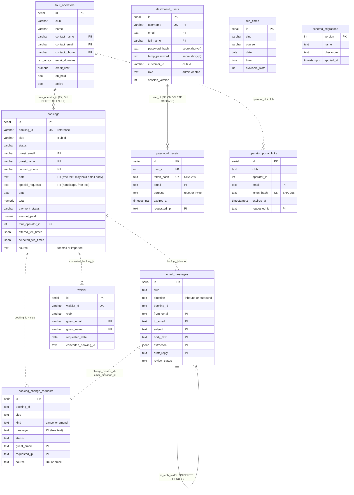

# Data model

The schema of the Postgres database shared by the dashboard and the core API, as defined by [`db/migrations/`](../db/migrations) (`0001`–`0005`). This repository owns it; see [MIGRATIONS.md](MIGRATIONS.md) for how it changes.

**PII** marks columns that hold personal data about guests, tour-operator contacts or staff. All tables live in the `public` schema.

## Entity relationships

Solid lines are foreign keys. Dotted lines are logical links by value (no constraint): most cross-table references use the text booking reference plus the club.

## Ownership

Who reads (R) and writes (W: insert/update/delete) each table, from `grep` of both codebases (`INSERT INTO`, `UPDATE`, `DELETE FROM`, `FROM`/`JOIN`). The dashboard's migrations create every table; no other process alters the schema.

| Table | Created by | Dashboard | Core API | Notes |
|---|---|---|---|---|
| `bookings` | `0001` | R/W (`routes/bookings.js`, `imports.js`, `waitlist.js`, `payments.js`, `portal.js`, `emails.js`, `reminders.js`, `operators.js`, `changes.js`, `lib/record-payment.js`, `lib/payment-sync.js`, `analytics.js`, `inbox.js`) | R/W (`db.py`, `booking_form.py`) | Core API creates enquiries and sets `Requested`; dashboard does everything else |
| `email_messages` | `0004` | R/W (`routes/inbox.js`, `lib/email-log.js`, `routes/portal.js`) | R/W (`email_log.py`, `Conolidated.py`) | Core API writes inbound + its outbound; dashboard writes its outbound, portal enquiries, review state |
| `booking_change_requests` | `0004` | R/W (`routes/changes.js`, `routes/portal.js`) | W (`email_log.py`) | Core API only inserts (`source = 'email'`) |
| `tee_times` | `0001` | — | R (`demo_tee_sheet.py`) | Optional; rows override the synthetic sheet. Loaded by hand (core API's `seed_royal_dornoch_tee_sheet.sql`) |
| `waitlist` | `0001` | R/W (`routes/waitlist.js`) | — | |
| `tour_operators` | `0001` | R/W (`routes/operators.js`, `portal.js`, `bookings.js`, `analytics.js`, `scripts/seed.mjs`) | — | |
| `dashboard_users` | `0002` | R/W (`auth.js`, `routes/auth.js`, `routes/users.js`, `index.js`, `scripts/seed.mjs`) | — | |
| `password_resets` | `0002` | R/W (`routes/auth.js`, `routes/users.js`) | — | |
| `operator_portal_links` | `0003` | W (`routes/portal.js`; redeemed by `UPDATE … RETURNING`) | — | |
| `schema_migrations` | `server/src/db/migrate.js` | R/W (migration runner only) | — | |

## Tables

### `bookings`

One row per booking or enquiry. Unique `booking_id` (reference, see [ARCHITECTURE.md](ARCHITECTURE.md#booking-references)); `club` scopes every query.

| Group | Columns | Notes |
|---|---|---|
| Identity | `id`, `booking_id`, `club`, `source` (`teemail`/`imported`, CHECK), `import_batch`, `imported_at` | |
| Guest (**PII**) | `guest_email`, `guest_name`, `contact_phone`, `special_requests` (handicaps, free text), `caddie_requirements`, `note` (staff notes; enquiries may carry the email text) | |
| Play | `date`, `tee_time`, `players`, `golf_dates[]`, `golf_courses`, `offered_tee_times` (written by core API), `selected_tee_times`, `form_submitted_at`, `customer_confirmed_at` | |
| Lodging | `hotel_*`, `lodging_*`, `resort_fee_per_person`, `resort_fee_total` | |
| Pipeline | `status` (`Inquiry`/`Requested`/`Booked`/`Rejected`/`Cancelled`), `timestamp`, `created_at`, `updated_at`, `updated_by` | No CHECK constraint on `status` |
| Money | `total`, `payment_status` (default `Unpaid`), `amount_paid`, `invoice_number`, `invoiced_at`, `deposit_due_date`, `balance_due_date` | |
| Stripe | `stripe_payment_link_id`, `stripe_payment_link_url`, `payment_link_amount`, `payment_link_sent_at/by`, `stripe_checkout_session_id` (idempotency key), `stripe_paid_at`, `stripe_payment_intent_id`, `stripe_last_payment_amount`, `payment_receipt_sent_at` | No card data |
| Trade | `tour_operator_id` (FK), `operator_status_email_sent_at`, `operator_payment_email_sent_at` | |
| Journey emails | `pre_arrival_email_sent_at`, `post_play_email_sent_at`, `pre_play_clock_started_at` | |

### `tour_operators`

Trade accounts per club: `name` (unique per club, case-insensitive), contact (`contact_name`, `contact_email`, `contact_phone` — **PII**), `account_code`, `email_domains[]` (identifies their bookings and who may sign in to the portal), credit terms (`payment_terms_days`, `deposit_percent`, `deposit_due_days_before_play`, `balance_due_days_before_play`, `credit_limit`, `currency`), `on_hold`, `active`, `notes`, audit columns.

### `waitlist`

Parties waiting for a time: `waitlist_id` (`WL-YYYYMMDD-XXXX`), `guest_email`, `guest_name` (**PII**), `requested_date`, `preferred_time`, `players`, `golf_course`, `status`, `priority`, `notes`, `notification_sent(_at)`, `converted_booking_id`, `converted_at`, `club`.

### `tee_times`

Optional bookable sheet the core API quotes from: `(club, course, date, time)` unique, `max_players`, `available_slots`, `is_available`, `green_fee`, `notes`. No personal data.

### `dashboard_users`

Staff accounts. `username` (unique, case-insensitive index) and `email` (unique when set) — **PII**; `full_name` — **PII**; `password_hash` (bcrypt, cost 12); `temp_password` (legacy; bcrypt-hashed at boot, `hashLegacyTempPasswords`); `must_change_password`; `customer_id` (the club the account belongs to); `role` (`admin`/`staff`, CHECK); `is_active`; `session_version` (bumped to revoke all sessions); `last_login`, `created_at`, `created_by`, `invited_at`.

### `password_resets`

Outstanding reset and invitation links: `user_id` (FK, cascade), `token_hash` (SHA-256 of the emailed token; the token itself is never stored), `email`, `purpose` (`reset`/`invite`, CHECK), `expires_at`, `used_at`, `requested_ip` (**PII**), `created_at`.

### `operator_portal_links`

One-time portal sign-in links: `club`, `operator_id` (no FK), `email` (**PII**), `token_hash` (SHA-256), `expires_at` (30 min), `used_at`, `requested_ip` (**PII**), `created_at`.

### `booking_change_requests`

Guest/operator requests to amend or cancel: `booking_id`, `club`, `kind` (`cancel`/`amend`, CHECK), `message` (**PII**, free text; email-sourced requests carry up to 5,000 chars incl. summary), `requested_date/time/players`, `status` (`Pending`/`Approved`/`Declined`/`Applied`, CHECK), `auto_applied` (always false now), `days_before_play`, `resolved_at/by`, `resolution_note`, `guest_email` and `requested_ip` (**PII**), `source` (`link`/`email`), `email_message_id`, `created_at`.

### `email_messages`

Every guest email in and out; `review_status = 'open'` is the Inbox. `club`, `direction`, `booking_id`; `from_email`, `to_email`, `subject`, `body_text` (inbound bodies up to 100,000 chars) — **PII**; `intent`, `summary`, `extraction` (JSONB: the Anthropic extraction and inbound metadata incl. SPF/DKIM, From header, Message-ID) — **PII**; `routed_to`; `change_request_id`; `review_status`, `review_reason`, `draft_reply` (**PII**), `handled_at/by`; `sent_by` (`bot`, `Stripe`, a username or `portal:<email>`), `kind`, `in_reply_to` (FK), `created_at`.

### `schema_migrations`

Created by the migration runner, not a migration file: `version`, `name`, `checksum` (SHA-256 of the file, CRLF-normalised), `applied_at`, `duration_ms`.

## Notes for reviewers

- There is no row-level security; isolation between clubs is enforced in application queries (`WHERE club = $n` / `customer_id = $n`). Both services connect with the same database credentials unless the operator has configured separate roles (**TO CONFIRM (owner)**).
- No column is encrypted at the application layer; encryption at rest depends on the Postgres provider (**TO CONFIRM (owner)**).
- Nothing in either service deletes data on a schedule; retention is discussed in [DATA_FLOWS.md](DATA_FLOWS.md#retention).
